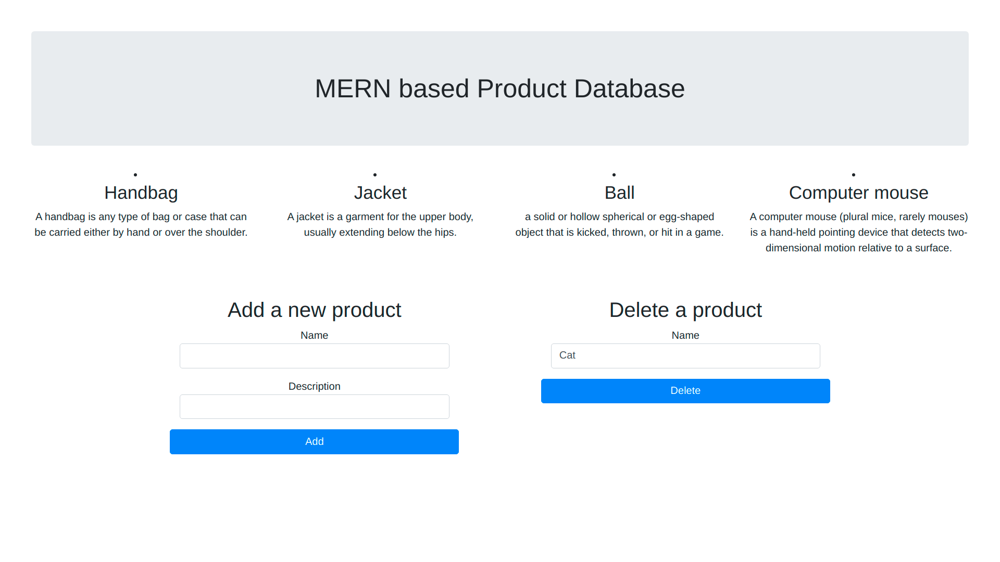
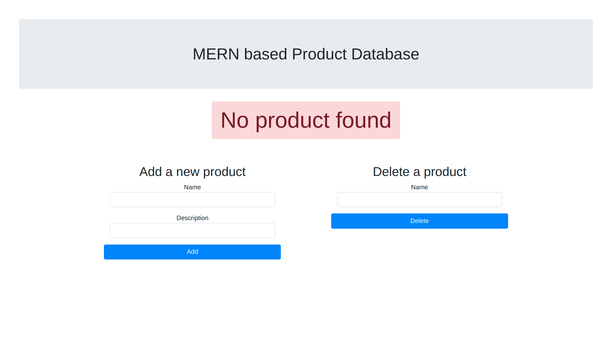

# Simple MERN based Product application
## Vercel deployments
 - [**mern-app-five.vercel.app**](mern-app-five.vercel.app)
 - [**mern-app-git-master-akcgjc007.vercel.app**](mern-app-git-master-akcgjc007.vercel.app)
 - [**mern-app-akcgjc007.vercel.app**](mern-app-akcgjc007.vercel.app)
## Description
A simple fullstack starter application using:
 - **MongoDB**
 - **Express.js**
 - **Node.js**
 - **React.js**

## Features
 - Add a product
 - Delete a product

## Demo

## How to run?
 - `yarn; cd client; yarn; cd ..`
 - `yarn dev`
