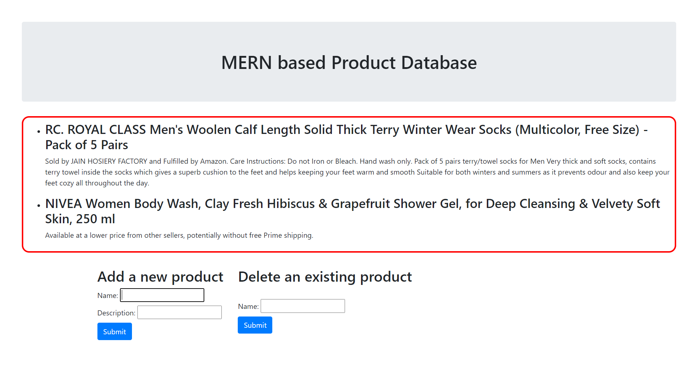

# Simple MERN based Product application
## Description
A simple fullstack starter application using Node.js, Express.js, React.js and MongoDB

## Features
 - **ADD()**
 - **DELETE()**

## Demo

## How to run?
 - `yarn; cd client; yarn; cd ..`
 - `yarn dev`